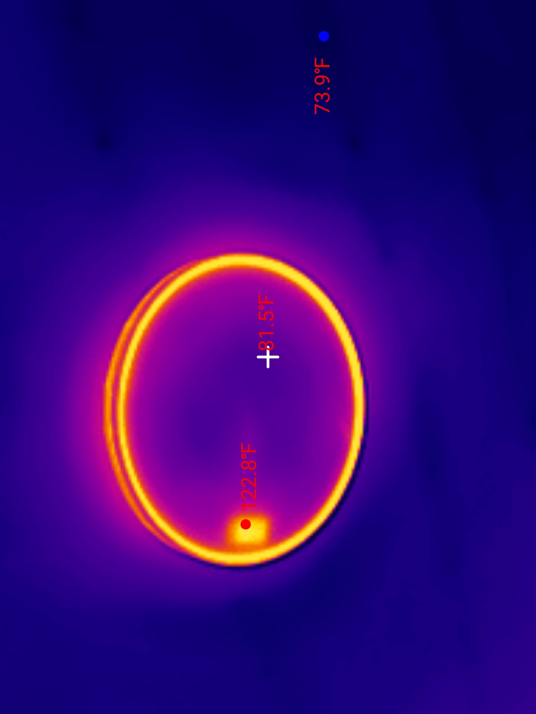
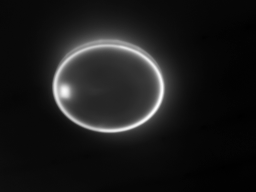
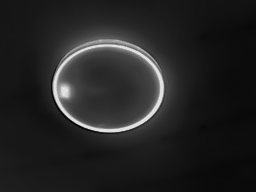

# Thermal Master P2 image extractor

Extracts embedded thermal data from JPEG files produced by the Thermal Master P2 infrared camera.

## The camera

The [Thermal Master P2](https://thermalmaster.com/products/thermal-master-p2) is a small thermal camera that plugs into phones via USB-C. Specs:

- 256 × 192 pixel infrared sensor
- NETD ≤40 mK
- -20°C to 600°C range, ±1.5°C accuracy

The app saves images as JPEGs. Files with embedded thermal data are 5-8 MB. Files without (exported or shared images) are 70-200 KB—just the visible colorized image with no raw data to extract.

## Sample Data

A sample image and its extracted output are included in the `sample-image/` directory.

**Input Image (Visible JPEG):**



**Extracted Thermal Data (Frame 01):**



**Extracted Preview (Frame 00):**



## What's inside these files

I reverse-engineered the file format. Here's what I found:

### JPEG marker layout

The camera stuffs data into JPEG APP markers before the actual image:

| Marker | Contents |
|--------|----------|
| FFE1 (APP1) | EXIF metadata—camera model, timestamp |
| FFE2 (APP2) | Some kind of "IJPEG" header |
| FFE3 (APP3) | Frame data, repeated 79 times (~5 MB total) |
| FFE4 (APP4) | Temperature-dependent correction table (~47 KB) |
| FFE5 (APP5) | Calibration data as floats |
| FFE6-FFE8 | Unknown, small |
| FFE9 (APP9) | String: "Thermal Master" |
| FFE0 (APP0) | JFIF header—the actual JPEG starts here |

### The frame data

The APP3 segments hold space for 52 frames. Each frame is 98,304 bytes (256 × 192 × 2 bytes). In practice, only two contain data:

| Frame | What it is |
|-------|------------|
| 00 | Grayscale preview, 8-bit |
| 01 | Raw thermal data, 16-bit little-endian |
| 02-51 | Typically Empty (all zeros) |

I'm not sure what the 02-51 area is for - I've seen at least one image with data in there, but it lookd like interlaced animaion but didn't seem to be related to the captured image?

### Frame 00 encoding (preview)

The preview uses a weird encoding. Each pixel is stored as two bytes:

```
[grayscale_value] [0x80] [grayscale_value] [0x80] ...
```

The actual pixel value is the first byte of each pair. The 0x80 bytes are padding.

### Frame 01 encoding (raw thermal)

This is the useful data. 16-bit unsigned integers, little-endian. These are raw ADC counts from the thermal sensor—not temperatures directly.

In one test image, values ranged from 18304 to 19304 for a typical indoor scene.

### Calibration data (APP5)

APP5 contains floats that are probably calibration parameters:

| Index | Probable meaning | Example |
|-------|------------------|---------|
| 0 | Ambient temp | 25.0 |
| 1 | Emissivity | 0.25 |
| 2 | Distance | 1.0 |
| 3 | Humidity | 0.8 |
| 4 | Reflected temp | 25.0 |

### APP4 contents (correction table)

APP4 contains a static correction table—identical across all images from the same camera. Likely factory calibration data baked into the firmware.

**Structure:**
- 57 blocks of 256 bytes each
- 64 entries per block (4 bytes per entry)
- Total: 47,340 bytes (~14,570 bytes of actual data, rest is zero padding)
- Block 0 appears to be header/metadata
- Actual correction entries start around entry 58 of block 0

**Entry format:**
```
[value1: uint16 LE][value2: uint16 LE]
```

The meaning of these fields is unclear. One value might be an offset, the other an index. The second value often falls in the 53-64 range.

**What we know:**
- Same data in every image from this camera
- Therefore it's static calibration, not per-image data
- Possibly related to sensor non-uniformity correction

The extractor saves this to `*_app4_correction.txt` for inspection.

The conversion formula is:

```
T(Kelvin) = raw / 64
T(°C) = raw / 64 - 273.15
T(°F) = raw × 0.028125 - 459.67
```

Quick reference:

| Raw | Kelvin | °C | °F |
|-----|--------|----|----|
| 16202 | 253.2 | -20.0 | -4.0 |
| 18000 | 281.2 | 8.1 | 46.6 |
| 19000 | 296.9 | 23.7 | 74.7 |
| 20000 | 312.5 | 39.4 | 102.8 |
| 55882 | 873.2 | 600.0 | 1112.0 |

The camera's full range (-20°C to 600°C) maps to raw values 16202-55882, which fits in 16-bit unsigned.

### The visible image

After all the APP markers, there's a normal JPEG showing the colorized thermal image with temperature annotations from the app.

## Installation

Requires Python 3.6+ with:

```bash
pip install numpy pillow opencv-python
```

OpenCV is optional—only needed for CLAHE enhancement.

## Usage

```bash
python extract_thermal.py <image.jpg> [options]
```

### Examples

```bash
# Basic extraction (PNG, non-empty frames only)
python extract_thermal.py thermal_image.jpg

# Enhanced contrast with CLAHE
python extract_thermal.py thermal_image.jpg --clahe

# 16-bit TIFF to preserve raw data
python extract_thermal.py thermal_image.jpg --format tif

# Everything: all frames (including empties), raw files, TIFF format
python extract_thermal.py thermal_image.jpg --all --format tif --save-raw
```

### Options

| Option | What it does |
|--------|--------------|
| `--all` | Extract all 52 frames, not just the two with data |
| `--format`, `-f` | Output format: png (default), tif, jpg, bmp, webp |
| `--clahe` | Apply CLAHE contrast enhancement |
| `--clahe-clip` | CLAHE clip limit, default 2.0. Higher = more contrast |
| `--clahe-grid` | CLAHE grid size, default 8. Smaller = more local |
| `--celsius` | Show temperatures in Celsius (default is Fahrenheit) |
| `--save-raw` | Also save .bin and .npy files |
| `--width` | Frame width if not 256 |
| `--height` | Frame height if not 192 |

### Output formats

| Format | Bit depth | Notes |
|--------|-----------|-------|
| png | 8-bit | Default. Lossless. |
| tif | 16-bit | Keeps the raw sensor values. Use this for analysis. |
| jpg | 8-bit | Lossy. Smaller files. |
| bmp | 8-bit | Uncompressed. |
| webp | 8-bit | Lossless, good compression. |

If you need the actual radiometric data, use TIFF. Everything else normalizes to 8-bit.

## Output files

The script creates a folder with the same name as the input file:

| File | Contents |
|------|----------|
| `*_metadata.txt` | Extraction report with EXIF, calibration, temperatures, processing notes |
| `*_visible.jpg` | The colorized image from the app |
| `frame_00_preview.ext` | 256×192 grayscale preview |
| `frame_01_thermal.ext` | 256×192 thermal data |
| `frame_XX_raw.bin` | Raw bytes (with --save-raw) |
| `frame_XX_thermal_raw.npy` | NumPy array (with --save-raw) |

The metadata file includes min/max/average temperatures for thermal frames.

## How the image processing works

### 8-bit output (PNG, JPG, etc.)

The 16-bit thermal data gets squeezed to 8-bit using min-max normalization:

```
output = (pixel - min) / (max - min) × 255
```

The script finds the coldest and hottest pixels in the frame and maps them to 0 and 255. Everything else scales linearly between them.

This loses precision. A scene with a 1000-count range (like 18304-19304) gets mapped to 256 levels. That's fine for viewing, but not for measurement.

### CLAHE

CLAHE (Contrast Limited Adaptive Histogram Equalization) enhances local contrast. It divides the image into tiles and equalizes each one separately, with a limit to prevent noise amplification.

Useful when the thermal image looks flat or when you want to see detail in both hot and cold regions at once.

The `--clahe-clip` parameter controls how much contrast boost is allowed (default 2.0). The `--clahe-grid` parameter sets the tile size (default 8×8).

CLAHE runs after the 8-bit normalization, so it doesn't help with precision—just visibility.

### 16-bit TIFF

TIFF output keeps the original 16-bit values with no processing. Use this if you want to:

- Calculate actual temperatures (once you have the formula)
- Do your own normalization
- Preserve maximum precision for analysis

## Will this work with other cameras?

I only tested it with files from one Thermal Master P2 (model string: `USB_IR_RS300_P2L`). It might work with other Thermal Master units. If you have files from a similar camera that don't work, open an issue. Sample files help.

## What I don't know

- What APP6, APP7, APP8 contain
- How exactly the APP5 calibration data is used (emissivity correction, atmospheric compensation, etc.)
- The exact averaging method the app uses for displayed temperatures (probably 3×3 neighborhood)
- The exact mapping between APP4 block numbers and sensor rows

The base temperature formula (raw/64 = Kelvin) is confirmed by comparing pixel values to the app's displayed temperatures.